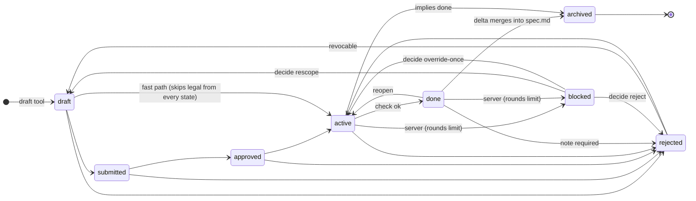

# spectackle

**A token-efficient, spec-driven MCP server for cross-language codebases.**

spectackle gives LLM coding agents (Claude Code, Codex CLI, and any other MCP
client) a complete, git-native spec lifecycle plus cross-language code
intelligence — so large refactors run on flat-rate agent tools instead of
usage-billed APIs:

```
            ┌─────────────────────────────────────────────────────┐
            │                    spectackle (MCP)                  │
 structural │  cross-language AST map      (Aider-inspired)       │
            │  go:Saxpy ─cgo→ c:launch ─launch→ cu:kernel         │
            ├─────────────────────────────────────────────────────┤
topological │  cascading spec bundles      (.spectackle/spec.md)   │
            │  root → module → directory, overrides explicit      │
            ├─────────────────────────────────────────────────────┤
   semantic │  EARS notation, linted       (WHEN …, X SHALL …)    │
            │  vague prose is a build error                       │
            ├─────────────────────────────────────────────────────┤
  lifecycle │  proposals → tasks → done → archived (+ revocable   │
            │  rejections); journal = the learn-from-failure      │
            │  corpus; drift detection closes the loop            │
            └─────────────────────────────────────────────────────┘
```

**The loop** (taught to the LLM by the server's own MCP instructions —
self-bootstrapping, no docs needed):

1. `find scope=rejection` — learn why similar work failed before.
2. `find scope=code` + `get depth=2` — impact radius across Go → C → CUDA/ASM.
3. `draft kind=proposal targets=…` — one round trip returns the **context
   pack**: impact, binding EARS contracts, similar past rejections.
4. On user approval: `move to=approved`, `draft` tasks, `rule op=add`
   contracts (server-composed EARS, lint-gated, auto-ID, elicitation).
5. Implement; `check` until `ok` — drift between code and contracts is
   detected via content-hash anchors and back-propagated as proposals.
6. `move to=done` → `to=archived` — the delta merges into the living spec;
   `compact` folds noise (rejections are never lost).

### Lifecycle — the finite automaton

Every hop is optional: any forward jump is a single move call (token
economy); only rejection needs a note and only archive has a guard (no open
children). `blocked` is the one side-state neither `move` nor the LLM can
set or clear directly — the server enters it on a rounds-limit escalation,
and its three exits are driven by `decide` (see
[docs/agent-workflow.md](docs/agent-workflow.md) "Bounded feedback loops").



The LLM **never writes spec files**: everything lives in versioned
`.spectackle/` folders (max three bundle files per context dir — no file
sprawl), written exclusively by the server; the SQLite/FTS5 cache underneath
is local-only and rebuilds from disk (no migrations, pre-v1 by design).

Initial focus: **Go** with arbitrary native bindings (cgo/C, C++, CUDA,
Plan 9 ASM, Objective-C/Metal, Vulkan); parser and resolver layers are
plugin interfaces for arbitrary languages later.

## Status (v0, pre-release — anything may break)

| Component | State |
|---|---|
| EARS linter + cascading spec bundles | ✅ live |
| Spec lifecycle: draft/move/archive, revocable rejections, journal corpus | ✅ live |
| Server-authored contracts (`rule`: slots → compose → lint gate → auto-ID, MCP elicitation) | ✅ live |
| Unified search (`find`) over rules/items/history/rejections (SQLite FTS5, pure Go) | ✅ live |
| Drift anchors + backprop (`check`/`compact`) | ✅ live |
| **Multi-agent swarm**: scope leases, shared coord.db, realtime sibling learnings, git-worktree isolation (`work start/submit/abort`) with semantic replay merge | ✅ live |
| Cross-language graph: `go/parser` + Plan 9 asm + CUDA line-scanner chains, persistent parse cache | ✅ live (tree-sitter/wazero still future, for full C/C++) |
| Self-hosting gate | 🔜 M5 ([roadmap](docs/roadmap.md)) |

## The chain, live

Real output, right now:

```
n go:saxpy.Saxpy fn examples/saxpy/saxpy/saxpy.go:21 sig=(n int,a float32,x,y []float32)error
n c:launch_saxpy fn examples/saxpy/saxpy/kernels/saxpy.cu:14
n go:main.main~2 fn examples/saxpy/main.go:12 sig=()
n cu:saxpy_kernel kernel examples/saxpy/saxpy/kernels/saxpy.cu:7
e go:saxpy.Saxpy cgo c:launch_saxpy via=examples/saxpy/saxpy/saxpy.go:25
e go:main.main~2 call go:saxpy.Saxpy via=examples/saxpy/main.go:20
e c:launch_saxpy launch cu:saxpy_kernel via=examples/saxpy/saxpy/kernels/saxpy.cu:27
```

That's `get {"id":"go:saxpy.Saxpy","depth":2}` against the shipped binary on this repo — not a mockup.

## Quickstart

```sh
make build                # -> bin/spectackle (pure Go, CGO_ENABLED=0)
./bin/spectackle lint .    # lint all EARS spec bundles
```

Register with Claude Code (or any MCP client):

```json
{
  "mcpServers": {
    "spectackle": {
      "command": "/absolute/path/to/bin/spectackle",
      "args": ["serve"]
    }
  }
}
```

The workspace root is auto-detected (`.spectackle/config.yaml` marker, then
git root, then `-root`).

### Entry points

- **`/spectackle`** (Claude Code repo command, `.claude/commands/spectackle.md`)
  — two modes on one command: bare (`$ARGUMENTS` empty) renders the current
  state pack, identical to `/spectackle-state`; given a requirement
  (`/spectackle add rate limiting to the API`) it drives the full SDD
  lifecycle end-to-end (research → draft → grill → decide-if-uncertain →
  approve → fan out to fresh implementers → check → archive).
- **`/spectackle-state`** — explicit state-only alias, no lifecycle side
  effects.
- **`/mcp__spectackle__workflow`** / **`/mcp__spectackle__next`** /
  **`/mcp__spectackle__state`** — the same entry points as native MCP
  prompts, available in any MCP-capable client once the server is
  registered; `workflow` takes the same optional `task` argument as the
  two-mode `/spectackle` command, so the two-mode entry point works
  identically outside Claude Code too.

## Headless quickstart (driving the server from a coding agent / CI)

No MCP client at hand? The server is plain JSON-RPC 2.0 over stdio — one
frame per line, stdout carries only JSON-RPC, logs go to stderr. The three
things that cost time on first contact:

1. **Handshake first**: send `initialize` (with `protocolVersion`), wait for
   the response, then send the `notifications/initialized` notification.
   Only then are `tools/call` requests answered.
2. **One JSON object per line**, no framing headers.
3. **Name your agent**: set `SPECTACKLE_AGENT=<name>` in the environment so
   swarm identity (leases, heartbeats, sw learnings) is stable across
   otherwise short-lived driver sessions — coordination state lives in the
   shared `.spectackle/cache/coord.db`, not in the process.

Minimal Python driver (each stdin line = one tool call):

```python
#!/usr/bin/env python3
# usage: mcp_call.py <root> <<'JSON'
# {"name": "swarm", "arguments": {}}
# {"name": "find", "arguments": {"q": "saxpy", "scope": "code"}}
# JSON
import json, subprocess, sys

proc = subprocess.Popen(["./bin/spectackle", "serve", "-root", sys.argv[1]],
    stdin=subprocess.PIPE, stdout=subprocess.PIPE,
    stderr=subprocess.DEVNULL, text=True, bufsize=1)
send = lambda o: (proc.stdin.write(json.dumps(o) + "\n"), proc.stdin.flush())
def recv():
    while True:
        line = proc.stdout.readline()
        if not line: return None
        try: return json.loads(line)
        except json.JSONDecodeError: continue

send({"jsonrpc": "2.0", "id": 1, "method": "initialize",
      "params": {"protocolVersion": "2025-06-18", "capabilities": {},
                 "clientInfo": {"name": "driver", "version": "0"}}})
recv()
send({"jsonrpc": "2.0", "method": "notifications/initialized"})
for rid, call in enumerate(map(json.loads, filter(str.strip, sys.stdin)), 100):
    send({"jsonrpc": "2.0", "id": rid, "method": "tools/call", "params": call})
    r = recv()
    print(f"\n===> {call['name']}")
    for c in r.get("result", {}).get("content", []):
        if c.get("type") == "text": print(c["text"])
```

First calls of any session: `swarm {}` (who else is working, fresh
learnings), then `get {"id": "."}` (root rules + active items) — the server
instructions returned by `initialize` teach the rest of the loop.

## Orchestrated swarm workflow (cheap fresh subagents)

This repo is developed the way it's meant to be used: **one strong
orchestrator plus a swarm of fresh, minimal-context implementer agents on a
cheaper model.** The two roles never overlap:

- **Orchestrator** (complex/strong model, persistent context) — drafts
  proposals, writes exhaustive task bodies, reviews implementer output, runs
  the final gate/verify, merges, and is the *only* role that commits or
  opens PRs.
- **Implementer** (simpler/cheaper model, zero prior context) — pulls
  exactly one approved task, does no exploration, implements it, tests it,
  and hands it back.

Each implementer is spawned fresh with nothing but two inputs: (a) the
task's full brief (`get <T-id>` — exact files, APIs, commands, constraints,
already resolved by the orchestrator) and (b) the headless driver recipe
above. The implementer loop is fixed and mechanical:

```
1. lease claim  — claim the task's declared scope (paths); on conflict,
                   pick a different task, never wait idle.
2. move active  — move the task id to "active".
3. implement    — edit only the declared scope; run the declared
                   build/test/verify commands until green.
4. move done    — move the task id to "done".
5. lease release — release the claimed scope immediately.
```

Why this shape: **exploration is the most expensive part of agentic
coding**, not editing — so the server replaces it for the orchestrator
(`find`/`get`/context packs instead of grepping the tree) and the task body
replaces it for the implementer (nothing to discover, only to execute).
Because the brief is written by the complex model, the simple model never
explores; that keeps the complex model's own context free of implementation
noise, and it makes token cost scale with the number of tasks, not the size
of the codebase. **Disjointness** across concurrently running implementers
is enforced by scope leases, not by convention — two agents can never
legally touch the same paths at once. The shared `.spectackle/cache/coord.db`
(leases, learnings, rejections, journal) is the swarm's common brain: every
sibling sees claims and rejections in real time via `swarm`, so failed
approaches are never retried blind.

**Fan-out**: once a batch of tasks is approved, the orchestrator partitions
them by disjoint scope (leases prove disjointness), spawns one fresh
implementer per task in parallel, and serializes only the shared-file
wiring itself.

For long-running swarms, run the server as a **resident service**
(`spectackle serve -http <addr>`, see [docs/architecture.md](docs/architecture.md)
§8) instead of spawning a fresh stdio process per agent — one shared
process, one shared cache, no cold-start per implementer.

Full role breakdown, sequence diagram, and the "exhaustive task body"
checklist: [docs/agent-workflow.md](docs/agent-workflow.md).

## Documentation

- [docs/lifecycle.md](docs/lifecycle.md) — **the lifecycle architecture**: storage, search, state machine, compacting, drift/backprop
- [docs/agent-workflow.md](docs/agent-workflow.md) — the orchestrator + fresh-implementer swarm workflow
- [docs/tools.md](docs/tools.md) — the 14 MCP tools: JSON Schemas + output grammar
- [docs/spec-cascade.md](docs/spec-cascade.md) — cascading spec bundles: format, resolution, authoring
- [docs/ears.md](docs/ears.md) — the EARS grammar and linter codes
- [docs/architecture.md](docs/architecture.md) — cross-language AST analysis (parsers, resolvers, graph)
- [docs/cookbook-new-language.md](docs/cookbook-new-language.md) — adding a language: one Spec value + two one-line registrations
- [docs/example-go-cuda.md](docs/example-go-cuda.md) — worked Go → CUDA lifecycle transcript
- [docs/roadmap.md](docs/roadmap.md) — milestones to self-hosting

## Dogfooding

This repository carries its own contracts in `.spectackle/` bundles;
`go test ./...` fails if any committed spec violates the EARS grammar, and
the `check` tool must come back clean on the repo itself — spectackle is its
own first user.
