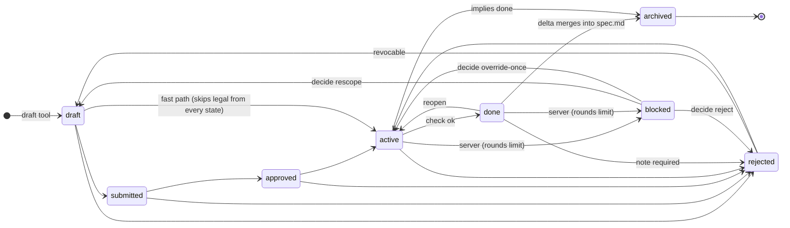
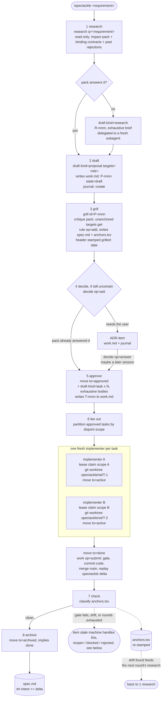
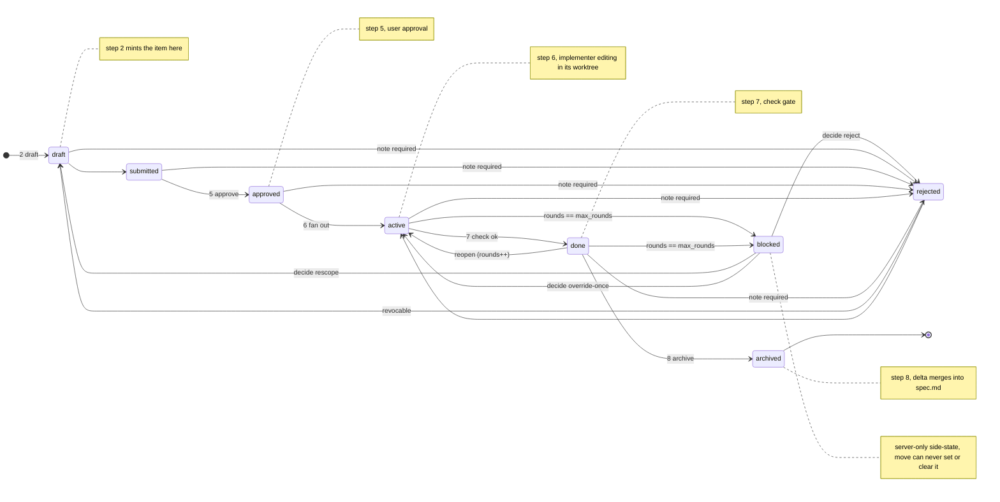

# spectackle

**A token-efficient, spec-driven MCP server for cross-language codebases.**

spectackle gives LLM coding agents (Claude Code, Codex CLI, and any other MCP
client) a complete, git-native spec lifecycle plus cross-language code
intelligence — so large refactors run on flat-rate agent tools instead of
usage-billed APIs:

```
            ┌─────────────────────────────────────────────────────┐
            │                    spectackle (MCP)                 │
 structural │  cross-language AST map      (Aider-inspired)       │
            │  go:Saxpy ─cgo→ c:launch ─launch→ cu:kernel         │
            ├─────────────────────────────────────────────────────┤
topological │  cascading spec bundles      (.spectackle/spec.md)  │
            │  root → module → directory, overrides explicit      │
            ├─────────────────────────────────────────────────────┤
   semantic │  EARS notation, linted       (WHEN …, X SHALL …)    │
            │  vague prose is a build error                       │
            ├─────────────────────────────────────────────────────┤
  lifecycle │  proposals → tasks → done → archived (+ revocable   │
            │  rejections); journal = the learn-from-failure      │
            │  corpus; drift detection closes the loop            │
            └─────────────────────────────────────────────────────┘
```

## Quickstart

Grab a prebuilt binary — no build required.

On macOS, via Homebrew:

```sh
brew install --cask jxsl13/tap/spectackle
```

Everywhere else, download the archive for your OS/arch from the
[latest release](https://github.com/jxsl13/spectackle/releases/latest);
assets are named `spectackle_<os>_<arch>.tar.gz` (`.zip` on Windows), for
`linux`/`darwin`/`windows` × `amd64`/`arm64`, alongside `checksums.txt`.

```sh
curl -L https://github.com/jxsl13/spectackle/releases/latest/download/spectackle_linux_amd64.tar.gz | tar xz
sudo mv spectackle /usr/local/bin/          # onto your PATH
```

To use a different platform, swap the `<os>` and `<arch>` segments in the URL:
`spectackle_<os>_<arch>.tar.gz` for `<os>` ∈ {`linux`, `darwin`, `windows`} and
`<arch>` ∈ {`amd64`, `arm64`}.

Then point **any** MCP client at the binary — the standard `mcpServers`
entry works across MCP clients:

```json
{
  "mcpServers": {
    "spectackle": {
      "command": "/absolute/path/to/spectackle",
      "args": ["serve"]
    }
  }
}
```

The workspace root auto-detects (git root, or a `.spectackle/config.yaml`
marker) — nothing else to configure. No tagged release yet? Build from
source (below) until the first release is published.

**The loop** (taught to the LLM by the server's own MCP instructions —
self-bootstrapping, no docs needed):

1. `find scope=rejection` — learn why similar work failed before.
2. `find scope=code` + `get depth=2` — impact radius across Go → C → CUDA/ASM.
3. `draft kind=proposal targets=…` — one round trip returns the **context
   pack**: impact, binding EARS contracts, similar past rejections.
4. On user approval: `move to=approved`, `draft` tasks, `rule op=add`
   contracts (server-composed EARS, lint-gated, auto-ID, elicitation).
5. Implement; `check` until `ok` — drift between code and contracts is
   detected via content-hash anchors and back-propagated as proposals.
6. `move to=done` → `to=archived` — the delta merges into the living spec;
   `compact` folds noise (rejections are never lost).

### Lifecycle — the finite automaton

Every hop is optional: any forward jump is a single move call (token
economy); only rejection needs a note and only archive has a guard (no open
children). `blocked` is the one side-state neither `move` nor the LLM can
set or clear directly — the server enters it on a rounds-limit escalation,
and its three exits are driven by `decide` (see
[docs/agent-workflow.md](docs/agent-workflow.md) "Bounded feedback loops").



The LLM **never writes spec files**: everything lives in versioned
`.spectackle/` folders (max three bundle files per context dir — no file
sprawl), written exclusively by the server; the SQLite/FTS5 cache underneath
is local-only and rebuilds from disk (no migrations, pre-v1 by design).

Focus: **Go** with arbitrary native bindings (cgo/C, C++, CUDA, Plan 9 ASM,
Objective-C/Metal; Vulkan future); the langspec parser layer makes a language
one data value ([cookbook](docs/cookbook-new-language.md), 29 languages),
resolvers bridge the FFI boundaries.

## Concepts: what one requirement sets in motion

Everything below is what `/spectackle <requirement>`
([.claude/commands/spectackle.md](.claude/commands/spectackle.md), the same
generated content also lives in [AGENTS.md](AGENTS.md)) literally runs when a
user hands the orchestrator a requirement: eight tool-driven steps, each
with a concrete, on-disk or on-swarm effect.



The item each proposal/task box carries also moves through its own state
machine — a second axis the workflow above drives but doesn't show. It's
broken out as its own diagram rather than folded into the one above because
combining both produced a picture nobody could read at a glance; the notes
on the right tie each state back to the step number that reaches it:



**Why rules live next to the code they govern.** A `spec.md` can exist in
any directory's `.spectackle/` folder, and its rules apply to that directory
and everything below it, unless a deeper file explicitly overrides a rule ID
or cuts inheritance (`inherits: false`). This mirrors how `.gitignore` and
`CLAUDE.md` cascade, and it's not cosmetic: resolving the rules for one file
path only walks the root-to-leaf spine of directories that path sits under
— an impact radius of three files pulls in at most three directory spines,
never the whole corpus.

**Why EARS instead of free prose.** Every rule sentence must parse as one
of six fixed patterns (`WHEN … SHALL`, `IF … THEN … SHALL`, …); vague prose
like "the server should handle errors appropriately" is a lint **error**,
not a style nit. The payoff: a rule is a single conditioned, measurable
clause an LLM can translate deterministically into any language in an
impact radius, because there's no interpretive latitude to translate
wrongly. Enforcement happens before anything is written — the `rule` tool
composes and lints a sentence before it ever touches `spec.md` — so a spec
bundle that made it to disk has already passed the grammar the linter
checks.

**Why a rule's code position and its wording are tracked as two separate
hashes.** An anchor binds one rule to one code span and records two
independent content hashes: one over the normalized code span, one over the
rule's own sentence. They drift on independent axes — code can be
refactored without the contract's meaning changing, and a contract's
wording can be tightened without the bound code moving a line — so crossing
them gives a classification a single "changed" bit couldn't: unchanged
code and rule is `ok` (or `moved`, if only the position shifted — silently
refreshed, not drift); code changed but the wording didn't is `evolved`,
the one class the server auto-heals, because the contract still describes
the code correctly and only the stored hash is stale; any wording change
(`tightened`, or `diverged` if the code changed too) is never auto-healed,
because the spec author's intent may have changed and a human has to look.

**Why nothing is ever thrown away.** Rejecting an item snapshots its full
body into the append-only journal before removing it from the active
`work.md`; compaction may fold ordinary `create`/`move`/`rule`/`drift`
noise, but `reject`, `archive` and `compact` lines are always kept
verbatim. That's what makes a rejection revocable much later — the server
rebuilds the item from its own snapshot — and what makes the rejection
corpus worth searching before repeating a failed approach: a corpus that
could quietly lose entries during compaction wouldn't be trustworthy.

**Why a strong orchestrator drafts and cheap implementers only execute.**
Exploration, not editing, is the expensive part of agentic coding — a model
that has to grep the tree and reconstruct constraints from scratch burns
far more tokens than the change itself costs. spectackle puts that cost on
one persistent, complex-model orchestrator that drafts, reviews and never
explores twice, and hands each cheap implementer a task body with nothing
left to discover. Because the brief absorbs the exploration, token cost
scales with the number of approved tasks, not the size of the codebase;
because scope leases — not convention — prove two tasks' declared paths are
disjoint, any number of implementers can run in parallel worktrees without
ever legally touching the same file.

**Why the LLM never writes these files.** Every file this section and the
next one describe is written exclusively by the server; the LLM only ever
calls a tool. That buys three things a hand edit cannot: the EARS lint gate
runs before a sentence is persisted, not after; a write's side effects (the
journal event, the anchor stamp, the search-index update) happen atomically
with the write itself, not as a separate step someone can forget; and every
server-written file carries a schema stamp, so a format change is a hard,
obvious break instead of a silent divergence between what an old file
contains and what new code expects.

## The chain, live

Real output, right now:

```
n go:saxpy.Saxpy fn examples/saxpy/saxpy/saxpy.go:21-36 sig=(n int,a float32,x,y []float32)error
n c:launch_saxpy fn examples/saxpy/saxpy/kernels/saxpy.cu:14-39
n go:main.main~2 fn examples/saxpy/main.go:12-24 sig=()
n cu:saxpy_kernel kernel examples/saxpy/saxpy/kernels/saxpy.cu:7-12
e go:saxpy.Saxpy cgo c:launch_saxpy via=examples/saxpy/saxpy/saxpy.go:25
e go:main.main~2 call go:saxpy.Saxpy via=examples/saxpy/main.go:20
e c:launch_saxpy launch cu:saxpy_kernel via=examples/saxpy/saxpy/kernels/saxpy.cu:27
r SXP-API-002 E examples/saxpy WHEN Saxpy is called with n less than 1 or a slice shorter than n, the Go binding SHALL return a non-nil `error` before crossing the cgo boundary.
r SXP-API-001 N examples/saxpy IF a CUDA wrapper returns a non-zero status, THEN the Go binding SHALL wrap the status in an error that contains the numeric CUDA status code.
r-root SPX-ARC-001 SPX-ARC-002 SPX-ARC-003 SPX-ARC-004 SPX-ARC-005 SPX-REPO-001 SPX-REPO-002 SPX-TST-001 SPX-SWM-001 SPX-SWM-002 SPX-SWM-003 SPX-SWM-004 SPX-SWM-005 SPX-SWM-006 SPX-SWM-007 SPX-ARC-006
```

That's `get {"id":"go:saxpy.Saxpy","depth":2}` against the shipped binary on this repo — not a mockup: the `n` spans, the cross-language `e` edges, and the node's binding contracts (`r`/`r-root`) all come from one call.

## Build from source

```sh
make build                # -> bin/spectackle (pure Go, CGO_ENABLED=0)
./bin/spectackle lint .    # lint all EARS spec bundles
```

Register with Claude Code (or any MCP client):

```json
{
  "mcpServers": {
    "spectackle": {
      "command": "/absolute/path/to/bin/spectackle",
      "args": ["serve"]
    }
  }
}
```

The workspace root is auto-detected (`.spectackle/config.yaml` marker, then
git root, then `-root`).

## CI/CD

Two GitHub Actions workflows, both mirroring what `make` already does
locally — so a green `make all` on your machine is the same gate CI runs.

**CI** (`.github/workflows/ci.yml`, on every push to `main` and every pull
request): `make build`, `go vet ./...`, `go test -race ./...`, the coverage
gate (`make cover`, ≥70%), the EARS linter fuzz run (`make fuzz`),
`spectackle lint .` over every spec bundle, and `make smoke`.

The last step is the self-hosting gate and the one worth knowing about: CI
spawns the freshly built server over stdio and calls the `check` tool on
this very repository, requiring output that is exactly `ok`. A drift
finding, an unanchored contract, or finished lifecycle items left
unarchived all fail the build — the repository's own records are part of
what CI verifies, not just its code.

**Release** (`.github/workflows/release.yml`, on any `v*` tag push): runs
`go test -race ./...` as a gate, then goreleaser builds and publishes
CGO-free binaries for linux, darwin and windows on amd64 and arm64, with
archives, `checksums.txt` and a generated changelog. The version reported
by `spectackle version` is stamped from the tag at build time. A Homebrew
cask is pushed to `jxsl13/homebrew-tap` in the same run; no code-signing
certificate is involved anywhere in the pipeline.

Cutting a release is one command — see
[docs/release.md](docs/release.md), including `make release-snapshot` for a
local dry run that publishes nothing.

### Entry points

- **`/spectackle`** (Claude Code repo command, `.claude/commands/spectackle.md`)
  — two modes on one command: bare (`$ARGUMENTS` empty) renders the current
  state pack, identical to `/spectackle-state`; given a requirement
  (`/spectackle add rate limiting to the API`) it drives the full SDD
  lifecycle end-to-end (research → draft → grill → decide-if-uncertain →
  approve → fan out to fresh implementers → check → archive).
- **`/spectackle-state`** — explicit state-only alias, no lifecycle side
  effects.
- **`/mcp__spectackle__workflow`** / **`/mcp__spectackle__next`** /
  **`/mcp__spectackle__state`** — the same entry points as native MCP
  prompts, available in any MCP-capable client once the server is
  registered; `workflow` takes the same optional `task` argument as the
  two-mode `/spectackle` command, so the two-mode entry point works
  identically outside Claude Code too.

## Headless quickstart (driving the server from a coding agent / CI)

No MCP client at hand? The binary ships its own MCP client (CLI-002) — no
external wrapper script needed, no hand-rolled JSON-RPC framing to get
wrong. Everything goes through the `call` subcommand:

```
spectackle call [-root DIR] [-http ADDR] [-instructions] [NAME [JSON]]
```

**One-shot call** — `NAME` plus an optional JSON arguments object issues
exactly that one call, spawning a fresh server over stdio and tearing it
down again:

```sh
./bin/spectackle call -root . find '{"q": "saxpy", "scope": "code"}'
```

Only the tool's rendered text lands on stdout, byte-identical, one
trailing newline — no envelope, no prefix, no banner, so it composes with
`grep`/`jq`/whatever's next in the pipeline. Connection diagnostics and any
spawned server's own stderr go to stderr instead. A refusal (`! GATE …`,
a schema validation error, …) still prints its text to stdout, but exits
non-zero — script against the exit code, not the prose.

**Multi-call batch** — omit `NAME` and pipe one `{"name": ..., "arguments":
{...}}` JSON object per line on stdin; every call in the batch runs over a
**single session**, so the workspace is indexed once for the whole batch
instead of once per call:

```sh
./bin/spectackle call -root . <<'JSON'
{"name": "swarm", "arguments": {}}
{"name": "find", "arguments": {"q": "saxpy", "scope": "code"}}
JSON
```

**The instructions manifest** — `-instructions` prints the server's
`initialize`-handshake instructions (the workflow contract: lifecycle loop,
swarm protocol, orchestration/fan-out, model tiering) and exits. Feed it to
a driving LLM verbatim; dropping it silently is the exact mistake an
earlier hand-rolled wrapper in this project made.

```sh
./bin/spectackle call -root . -instructions
```

**Name your agent**: set `SPECTACKLE_AGENT=<name>` in the environment so
swarm identity (leases, heartbeats, sw learnings) is stable across
otherwise short-lived `call` invocations — coordination state lives in the
shared `.spectackle/cache/coord.db`, not in the process.

First calls of any session: `swarm {}` (who else is working, fresh
learnings), then `get {"id": "."}` (root rules + active items) — the
instructions manifest above teaches the rest of the loop.

## Resident service (recommended for more than one call)

Spawning a fresh server per `call` is right for a single one-shot
invocation, but its cost is that **every invocation re-indexes the
workspace from scratch** — 163 files on this repo, at each and every
start. Wasteful for a swarm of implementers, a long CI job, or anything
issuing more than one call across separate `call` invocations, where a
resident process indexes **once** and answers every later call from the
warm cache instead. (A single `call` invocation with a multi-line stdin
batch already shares one session and one index — this section is for
sharing that index *across* invocations too.)

**Recommended: `make dev`.** It builds the current tree, stops any resident
dev server already running, starts a fresh one over Streamable HTTP with a
pidfile, and only returns once a real `state` call answers — so it's safe
to run repeatedly (e.g. after every merge; see
[CONTRIBUTING.md](CONTRIBUTING.md#the-resident-server-must-be-rebuilt-and-restarted-after-every-merge))
without ever leaving two servers on one port or wedging on a stale pidfile:

```sh
make dev         # build + restart, blocks until it answers a real call
make dev-status  # report whether it's running, without changing anything
make dev-stop    # stop it (a no-op if nothing is running)
```

It binds `127.0.0.1:7412` with pidfile `bin/dev.pid` by default — override
with `DEV_ADDR=... DEV_PIDFILE=...` the same way `BIN`/`GO`/etc are
overridable elsewhere in the Makefile.

**Manual invocation**, for anyone not using `make` — bind it to localhost
with a pidfile so it has a stoppable handle:

```sh
./bin/spectackle serve -root . -http 127.0.0.1:7331 -pidfile .spectackle/serve.pid &
```

Point `call` at it with `-http` instead of spawning a fresh stdio server —
same one-shot and stdin-batch input modes, same byte-identical stdout
rendering, only the transport changes:

```sh
./bin/spectackle call -http 127.0.0.1:7331 find '{"q": "saxpy", "scope": "code"}'
```

Any other Streamable-HTTP-capable MCP client can point at
`http://127.0.0.1:7331` too. Stop the resident server with the pidfile it
wrote:

```sh
kill "$(cat .spectackle/serve.pid)"
```

`-pidfile PATH` is optional (empty by default, no file written) and is not
gated on `-http` — it helps a backgrounded stdio server exactly the same
way. Semantics: the PID is written, decimal plus a trailing newline, only
*after* the listener is bound (never before — a pidfile that exists while
the port is still coming up would let a stop command race startup); the
file is removed automatically on graceful shutdown (SIGINT/SIGTERM); and
`serve` refuses to start if the path already exists, since that usually
means a server is already running there and overwriting it would strand
that process with no way to be found and stopped.

**Which one to use**: keep the default stdio transport for anything that
registers spectackle as an `mcpServers` entry (Claude Code, the Quickstart
above, every MCP client that spawns the binary itself) — that is the
transport those clients speak, and swapping it for HTTP would break every
existing config. Reach for the resident `-http` service, and `call -http`,
when *you* are the one issuing repeated calls — a swarm, a script, a CI
job — and want to pay the 163-file index cost once instead of on every
call. See also [docs/architecture.md](docs/architecture.md) §8 for the v0
caveat (one shared server instance backs every HTTP session).

## Orchestrated swarm workflow (cheap fresh subagents)

This repo is developed the way it's meant to be used: **one strong
orchestrator plus a swarm of fresh, minimal-context implementer agents on a
cheaper model.** The two roles never overlap:

- **Orchestrator** (complex/strong model, persistent context) — drafts
  proposals, writes exhaustive task bodies, reviews implementer output, runs
  the final gate/verify, merges, and is the *only* role that commits or
  opens PRs.
- **Implementer** (simpler/cheaper model, zero prior context) — pulls
  exactly one approved task, does no exploration, implements it, tests it,
  and hands it back.

Each implementer is spawned fresh with nothing but two inputs: (a) the
task's full brief (`get <T-id>` — exact files, APIs, commands, constraints,
already resolved by the orchestrator) and (b) the headless driver recipe
above. The implementer loop is fixed and mechanical:

```
1. lease claim  — claim the task's declared scope (paths); on conflict,
                   pick a different task, never wait idle.
2. move active  — move the task id to "active".
3. implement    — edit only the declared scope; run the declared
                   build/test/verify commands until green.
4. move done    — move the task id to "done".
5. lease release — release the claimed scope immediately.
```

Why this shape: **exploration is the most expensive part of agentic
coding**, not editing — so the server replaces it for the orchestrator
(`find`/`get`/context packs instead of grepping the tree) and the task body
replaces it for the implementer (nothing to discover, only to execute).
Because the brief is written by the complex model, the simple model never
explores; that keeps the complex model's own context free of implementation
noise, and it makes token cost scale with the number of tasks, not the size
of the codebase. **Disjointness** across concurrently running implementers
is enforced by scope leases, not by convention — two agents can never
legally touch the same paths at once. The shared `.spectackle/cache/coord.db`
(leases, learnings, rejections, journal) is the swarm's common brain: every
sibling sees claims and rejections in real time via `swarm`, so failed
approaches are never retried blind.

**Fan-out**: once a batch of tasks is approved, the orchestrator partitions
them by disjoint scope (leases prove disjointness), spawns one fresh
implementer per task in parallel, and serializes only the shared-file
wiring itself.

For long-running swarms, run the server as a **resident service** (see
"Resident service" above, and [docs/architecture.md](docs/architecture.md)
§8) instead of spawning a fresh stdio process per agent — one shared
process, one shared cache, no cold-start per implementer.

Full role breakdown, sequence diagram, and the "exhaustive task body"
checklist: [docs/agent-workflow.md](docs/agent-workflow.md).

## Persisted data structures

Every structure spectackle keeps on disk or in a shared database, where it
lives, what it holds, and — the part that actually explains the layout —
why it's a separate structure rather than a field bolted onto something
else.

**`.spectackle/spec.md`** — the living spec, one per directory that needs
directory-scoped rules (root's is repo-wide). YAML front matter (`schema`,
`prefix`, `scope`, `inherits`, `overrides`) plus a markdown body: a
`## intent` (and optional `notes`/`design`/`context`) prose section, and one
`## <RULE-ID>` heading per EARS rule, each with an optional
`{applies: id,id}` binding and an optional `Rationale:` paragraph. Rules
resolve root → ancestor spine → nearest directory, deeper files extending by
default, winning only via explicit `overrides:` or `inherits: false`. It's
its own file, per directory, because it's the one structure meant for git
review — and because directory-scoped cascading (see Concepts above) is
only possible if a directory can have its own file with its own scope;
folding every directory's rules into one repo-wide document would collapse
the entire "load only the spine of an impact radius" argument.

**`.spectackle/work.md`** — **active items only**: one `## <ID> <title>`
block per item in state draft/submitted/approved/active/done/blocked, each
with a flat `key: value` machine header (kind, state, created, parent,
refs, targets, rules, goal, rounds, grilled, needs, override, and the ADR
fields context/decision/consequences/status) and a free-text body. The
moment an item is rejected or archived, its block is deleted from work.md.
Active-only is deliberate: an item's outcome is a historical fact nobody
edits again, so keeping it in work.md forever would grow the file without
bound as a repo ages — and every tool call reads work.md, so a file that
never stops growing would make every call slower for information nobody
needs live. Nothing is lost by removing the block: the journal already
carries the full history, because `archive`/`reject` events are never
compacted away.

**`.spectackle/journal.ndjson`** — the append-only event log, one per
`.spectackle/` folder, one compact JSON object per line
(`create`/`move`/`rule`/`archive`/`reject`/`drift`/`compact`/`start`/`submit`/`abort`/`grill`/`decide`/`escalate`),
each stamped with a unique event ID and the writing agent. It's the source
of truth work.md and spec.md are only current snapshots of. Compaction may
fold ordinary `create`/`move`/`rule`/`drift` noise, but `reject`, `archive`
and `compact` lines are always kept verbatim — append-only, with that one
carve-out, because a rejection snapshot has to survive compaction for
`move` to be able to revoke it later, and the searchable rejection corpus
(`find scope=rejection`) is only trustworthy if entries can't quietly
disappear. The server-written `.gitattributes` sets `merge=union` on this
file specifically: append-only content merges conflict-free across
branches, so the highest-churn file in the whole system was designed to
never need a real merge.

**`.spectackle/anchors.tsv`** — root-only, tab-separated rows
`rule  node  file  span  chash  rhash` binding an EARS rule to the code span
it was last stamped against. `chash` hashes the normalized code span
(CRLF→LF, trailing whitespace stripped, indentation preserved — it's
semantic in languages like Plan 9 asm); `rhash` hashes the rule's own
sentence. They're two hashes, not one, because code and rule wording drift
on independent axes: code can be refactored without the contract's meaning
changing, and a contract's wording can be tightened without the bound code
moving a line. Crossing the two axes is the classification `check` reports:
same code, same rule → `ok` (or `moved` if only the position shifted —
silently refreshed, not drift); code changed, rule unchanged → `evolved`;
code unchanged, rule changed → `tightened`; both changed → `diverged`. Only
`evolved` is ever auto-healed — the rule still describes the code
correctly, only the stored hash is stale — because `tightened` and
`diverged` both involve a wording change, which means the spec author's
intent may have changed, and a human has to look rather than have the
server silently paper over an actual contract change.

**`.spectackle/config.yaml`** — root-only settings: schema, `langs`,
`ignore`/`ignore_regex` prune patterns, `budget_default`, compact
thresholds (`journal_max`, `done_max`), swarm tuning (`lease_ttl`,
`agent_ttl`), feedback tuning (`max_rounds`, `grill`), `worktrees_dir`,
`verify` gate commands. It's the one structure a human is expected to
hand-edit: the server scaffolds it on first use with every default value
written out and commented, so the file doubles as its own reference
documentation, and — unlike everything else in this list — an *existing*
config.yaml is never regenerated or rewritten by the server; hand edits are
permanent until the user changes them.

**`.spectackle/cache/`** — root-only, gitignored, holding `index.db`
(SQLite FTS5, pure Go, the search index over every rule/item/journal/
rejection record, and the cross-language code graph once the indexer runs)
and `coord.db` (below). Everything under `cache/` is derived from the
versioned files (spec.md/work.md/journal.ndjson/anchors.tsv) plus a scan of
the source tree — nothing lives here that isn't reconstructable. That
invariant is what makes deleting the directory safe: a mismatched
generation stamp already triggers the same drop-and-rebuild automatically,
so deleting it by hand is just a slower path to the outcome the server
would reach on its own, never a knowledge-loss event.

**`coord.db`** — `.spectackle/cache/coord.db` of the *main* repo (a linked
worktree resolves it via `git rev-parse --git-common-dir`); WAL-mode
SQLite. Owns the agent registry (heartbeats), scope leases (path/item pairs
with an expiry, so a conflicting claim can name its holder), the global
item/rule ID counters (floor-seeded, so deleting the DB can never regress
an ID or let two worktrees mint the same one), the swarm event log siblings
piggyback learnings from, worktree records, and the single integrate lock.
It's SQLite/WAL rather than a plain file because multiple spectackle
processes — one per agent session — write it concurrently: a plain file
under concurrent read-modify-write is a race where the last writer wins and
silently drops a lease or a counter bump, while WAL-mode SQLite gives every
writer a real transaction, so a claim or a mint from one process can never
be lost to a concurrent write from another. It lives under `cache/`,
unversioned, on purpose — in the package's own words, "coord.db is
unversioned but NOT knowledge: losing it loses only ephemeral coordination
state."

**The knowledge artifact** — produced by `internal/knowledge`, this is
**portable interchange, not workspace state**: nowhere inside a workspace's
`.spectackle/` folder by default, but a standalone document meant to travel
to wherever a caller directs it (review, or seeding another repository).
Same front-matter-fenced markdown family as spec.md (`schema`,
`kind: knowledge`, `sources`), with one `## rule|adr|intent <key>` section
per entry. Holds rule sentences, ADRs, and intent prose lifted verbatim out
of one or more repositories' spec/item corpora — never paraphrased — each
carrying a recurrence count and the provenance (source repo + dir) that
asserted it or was drawn on to generalize it. Everything else in this list
is one repository's own record of itself; the knowledge artifact is the
opposite, an interchange format meant to move between repositories.
Conflating it with spec.md would make an inherently cross-repo artifact
look like a local contract, which structurally it is not.

**Two invariants that explain the shape of everything above:**

- **No migrations, ever, pre-1.0.** Every server-written file above carries
  a `schema` stamp (`v0` today); the moment the on-disk format changes, the
  stamp changes with it, and a file carrying the old stamp is a hard tool
  error ("regenerate"), never something the server tries to upgrade in
  place. Pre-1.0, the format may break at any time — there is no migration
  mechanism anywhere in the codebase to break.
- **The LLM never writes any of these files directly.** Minting an item,
  composing a rule, appending a journal event, stamping an anchor, bumping
  a counter — every one of those is a server-side write path reached only
  through a tool call. That is what lets every other property above hold:
  the lint gate runs before a write, not after; a write's side effects
  (journal event, anchor stamp, index update) happen atomically with it;
  and `spectackle lint .` in CI can trust that anything on disk went
  through the one gate that produces it.

## Documentation

- [docs/lifecycle.md](docs/lifecycle.md) — **the lifecycle architecture**: storage, search, state machine, compacting, drift/backprop
- [docs/agent-workflow.md](docs/agent-workflow.md) — the orchestrator + fresh-implementer swarm workflow
- [docs/tools.md](docs/tools.md) — the 15 MCP tools: JSON Schemas + output grammar
- [docs/spec-cascade.md](docs/spec-cascade.md) — cascading spec bundles: format, resolution, authoring
- [docs/ears.md](docs/ears.md) — the EARS grammar and linter codes
- [docs/architecture.md](docs/architecture.md) — cross-language AST analysis (parsers, resolvers, graph)
- [docs/cookbook-new-language.md](docs/cookbook-new-language.md) — adding a language: one Spec value + two one-line registrations
- [docs/example-go-cuda.md](docs/example-go-cuda.md) — worked Go → CUDA lifecycle transcript
- [docs/release.md](docs/release.md) — cutting a release: tag, gate, artifacts
- [docs/roadmap.md](docs/roadmap.md) — milestones and what is still open

## Dogfooding

This repository carries its own contracts in `.spectackle/` bundles;
`go test ./...` fails if any committed spec violates the EARS grammar, and
the `check` tool must come back clean on the repo itself — spectackle is its
own first user.
